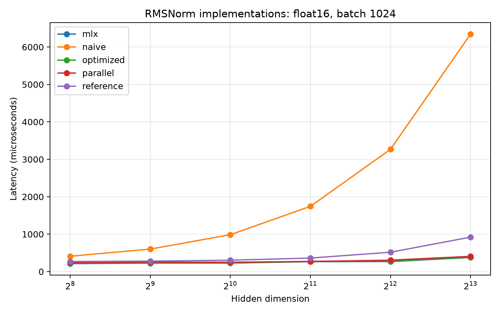
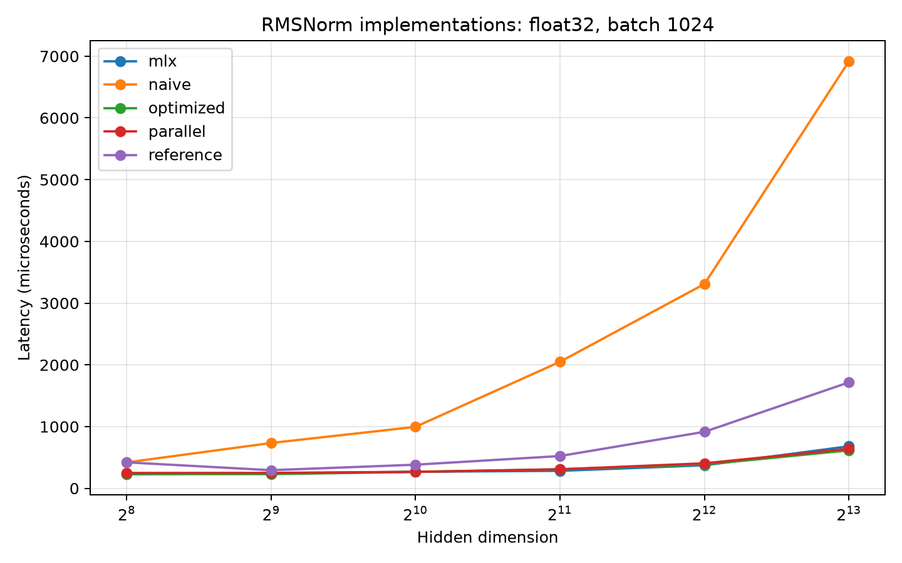
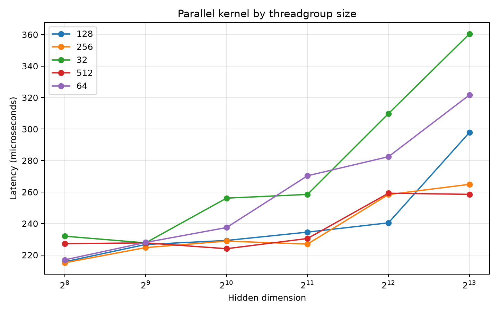
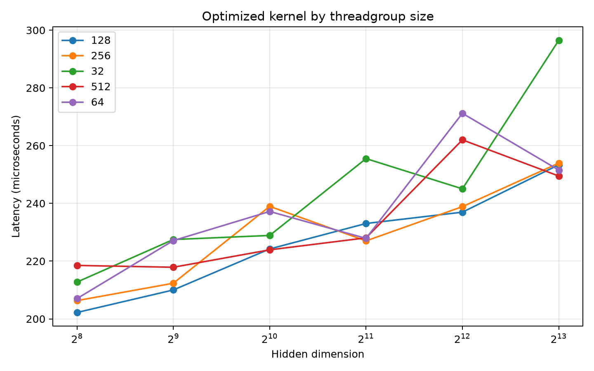
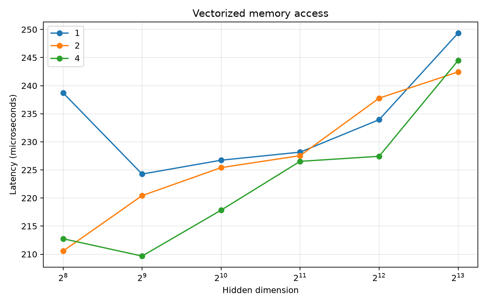
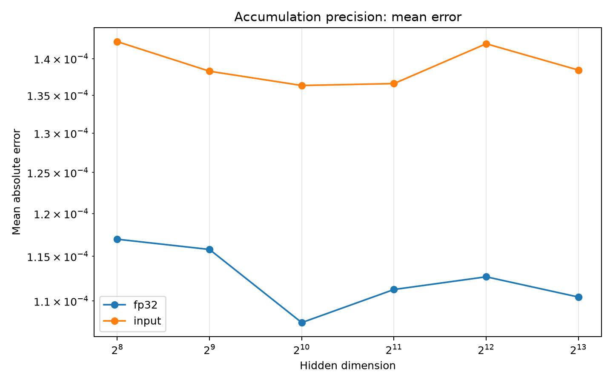
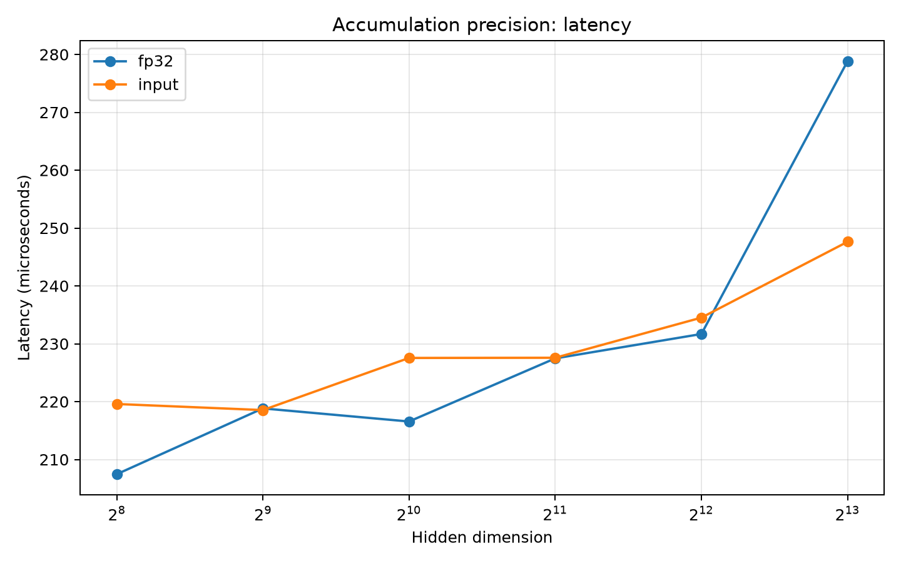

# RMSNorm Metal Kernels for MLX

This project implements and optimizes fused RMSNorm kernels in Metal through
MLX. It studies parallel reduction, threadgroup size, SIMD-group reduction,
vectorized memory access, and accumulation precision against
`mx.fast.rms_norm`.

For a row of width `D`, RMSNorm computes:

```text
inv_rms = 1 / sqrt(mean(x²) + eps)
output  = x * inv_rms * weight
```

## Implementations

```text
Pure MLX reference
        ↓
Naive Metal: one thread per row
        ↓
Parallel Metal: one threadgroup per row
        ↓
Threadgroup-memory tree reduction
        ↓
SIMD-group reduction
        ↓
Scalar / 2-wide / 4-wide memory access
        ↓
Selectable input-precision / FP32 accumulation
```

- `rmsnorm/reference.py`: pure MLX and `mx.fast.rms_norm` baselines.
- `rmsnorm/kernel_naive.py`: one GPU thread processes one row sequentially.
- `rmsnorm/kernel_parallel.py`: one threadgroup processes one row using a
  threadgroup-memory tree reduction.
- `rmsnorm/kernel_optimized.py`: SIMD-group reduction with configurable vector
  width and accumulation precision.

All custom kernels fuse reduction, normalization, and multiplication by the
weight vector into one dispatch. The default optimized configuration uses
four-element loads and FP32 accumulation.

## Setup

MLX requires an Apple Silicon Mac.

```bash
python3.12 -m venv .venv
source .venv/bin/activate
python -m pip install mlx pytest matplotlib
```

## Benchmark method

MLX evaluates lazily, so every measured call is explicitly evaluated and the
execution stream is synchronized. Each final result uses:

- 50 warmup iterations
- 500 measured iterations
- 5 independent repetitions
- the median as the primary result
- minimum and maximum values to expose run-to-run variability
- a fixed random seed

The implementation matrix covers batches 1, 16, 128, and 1024; hidden
dimensions 256 through 8192; and FP16 and FP32. Latencies are in microseconds.

Measurements were collected on:

- MacBook Pro with Apple M1 Pro and 16 GB memory
- macOS 26.6.2
- Python 3.12.6
- MLX 0.32.2

## Results

### End-to-end implementation comparison

These tables show median latency for batch 1024, where GPU work is large
enough to make the algorithmic differences clear.

#### FP16

| Hidden dimension | Reference | Naive | Parallel | Optimized | MLX |
|---:|---:|---:|---:|---:|---:|
| 256 | 269.649 | 410.855 | 240.089 | 228.928 | 212.717 |
| 512 | 279.873 | 601.208 | 253.493 | 230.253 | 227.153 |
| 1024 | 304.391 | 986.346 | 249.471 | 228.943 | 228.513 |
| 2048 | 361.797 | 1744.150 | 270.971 | 272.888 | 266.153 |
| 4096 | 518.165 | 3266.932 | 305.454 | 280.430 | 267.776 |
| 8192 | 921.049 | 6347.692 | 407.402 | 382.203 | 377.206 |



#### FP32

| Hidden dimension | Reference | Naive | Parallel | Optimized | MLX |
|---:|---:|---:|---:|---:|---:|
| 256 | 420.901 | 419.304 | 248.404 | 232.897 | 228.232 |
| 512 | 293.301 | 733.781 | 249.471 | 229.639 | 240.437 |
| 1024 | 382.496 | 995.558 | 267.200 | 265.310 | 268.044 |
| 2048 | 522.884 | 2049.481 | 307.617 | 308.732 | 283.063 |
| 4096 | 915.330 | 3309.894 | 405.015 | 385.553 | 372.853 |
| 8192 | 1716.493 | 6918.765 | 639.674 | 615.008 | 680.906 |



Across all 48 batch/shape/dtype configurations, the optimized custom kernel
was faster than MLX in 11 cases and had an arithmetic mean latency ratio of
1.052, or about 5.2% higher latency than MLX overall. Close wins should be
treated as ties when their measured ranges overlap.

The main result is the scaling improvement over the deliberately serial
kernel. At batch 1024, the optimized kernel is 1.8x to 16.6x faster than the
naive kernel. The advantage grows with hidden dimension because the naive
kernel makes one thread perform the entire reduction sequentially. The
optimized kernel is also 1.2x to 2.8x faster than the unfused pure-MLX
expression at this batch size.

For FP16 at hidden dimension 8192, optimization reduces latency from 6347.692
to 382.203 microseconds, a 16.6x speedup, while MLX takes 377.206 microseconds.
The custom kernel is therefore within 1.3% of MLX on this representative large
case. For FP32 at the same shape, the optimized median is lower than the MLX
median, but MLX's measured range is much wider and overlaps the optimized
range, so the data does not support a general claim that the custom kernel is
faster.

### Threadgroup size

The threadgroup experiment uses FP16 with batch 128. The table reports the
best median configuration for each implementation and hidden dimension.

| Hidden dimension | Best parallel size | Parallel latency | Best optimized size | Optimized latency |
|---:|---:|---:|---:|---:|
| 256 | 256 | 215.057 | 128 | 202.212 |
| 512 | 256 | 224.716 | 128 | 210.016 |
| 1024 | 512 | 224.013 | 512 | 223.914 |
| 2048 | 256 | 226.956 | 256 | 227.012 |
| 4096 | 128 | 240.438 | 128 | 236.962 |
| 8192 | 512 | 258.544 | 512 | 249.479 |





There is no universally optimal threadgroup size. Sizes 128 and 256 work well
for many rows, while 512 is best for the tested 1024- and 8192-wide rows. The
result is not monotonic: adding threads can reduce per-thread work, but it can
also increase reduction, scheduling, and synchronization overhead. This is
why threadgroup size should be tuned against actual shapes instead of fixed by
rule of thumb.

### Vectorized memory access

This experiment uses the optimized FP32-accumulation kernel with FP16 input,
batch 128, and a 256-thread group.

| Hidden dimension | Scalar | 2-wide | 4-wide | Best width |
|---:|---:|---:|---:|---:|
| 256 | 238.725 | 210.562 | 212.751 | 2 |
| 512 | 224.265 | 220.427 | 209.666 | 4 |
| 1024 | 226.732 | 225.410 | 217.837 | 4 |
| 2048 | 228.167 | 227.544 | 226.528 | 4 |
| 4096 | 233.941 | 237.778 | 227.427 | 4 |
| 8192 | 249.371 | 242.453 | 244.491 | 2 |



Four-wide access reduces scalar-access latency by 0.7% to 10.9%, depending on the
hidden dimension. It wins four of six shapes, while two-wide access wins at
256 and 8192. The effect is modest and workload-dependent rather than a
universal four-times improvement: the kernel still performs the same amount
of arithmetic and reduction work, and dispatch/synchronization overhead is a
large part of these sub-millisecond measurements.

### Accumulation precision

This experiment uses FP16 input, batch 128, four-wide access, and 256 threads.
Errors are measured against `mx.fast.rms_norm` after converting outputs to
FP32 for comparison.

| Hidden dimension | Input-precision latency | FP32 latency | Input mean error | FP32 mean error | Error reduction |
|---:|---:|---:|---:|---:|---:|
| 256 | 219.587 | 207.451 | 1.424e-4 | 1.170e-4 | 17.9% |
| 512 | 218.537 | 218.827 | 1.383e-4 | 1.158e-4 | 16.3% |
| 1024 | 227.545 | 216.562 | 1.363e-4 | 1.077e-4 | 21.0% |
| 2048 | 227.577 | 227.471 | 1.366e-4 | 1.113e-4 | 18.5% |
| 4096 | 234.512 | 231.684 | 1.421e-4 | 1.127e-4 | 20.7% |
| 8192 | 247.623 | 278.832 | 1.384e-4 | 1.104e-4 | 20.2% |





FP32 accumulation lowers mean absolute error by 16.3% to 21.0% for every
tested dimension. Its latency is effectively tied with or lower than input
precision for five of six shapes; the 8192-wide measurement is the exception,
where FP32 is 12.6% slower. Since the accuracy improvement is consistent while
the performance difference is generally small and noisy, FP32 is the better
default for this implementation.

## Conclusions

1. Parallel reduction is the decisive optimization. It changes the large-row
   behavior from serial work in one thread to cooperative work across a
   threadgroup and produces up to a 16.6x speedup over the naive kernel.
2. Fusion matters. The custom kernels avoid materializing the intermediate
   square, mean, reciprocal-root, and scaled arrays and reach up to 2.8x the
   speed of the pure expression at batch 1024.
3. SIMD-group reduction and vectorization close most of the remaining gap to
   MLX, but their benefits depend on shape and launch configuration.
4. Threadgroup tuning is empirical. No single tested size wins every hidden
   dimension.
5. FP32 accumulation is the preferred numerical choice: it consistently
   reduces error with little consistent performance penalty.
6. The final kernel is close to a production implementation rather than
   universally faster than it. Across the full matrix it averages about 5.2%
   higher latency than MLX, with some ties and overlapping-range wins.

## Reproducing the experiments

```bash
python -m pytest -v | tee results/tests.txt
python -m benchmarks.benchmark --suite implementations > results/implementations.csv
python -m benchmarks.benchmark --suite threadgroups > results/threadgroups.csv
python -m benchmarks.benchmark --suite vectorization > results/vectorization.csv
python -m benchmarks.benchmark --suite precision > results/precision.csv

python -m benchmarks.plot results/implementations.csv
python -m benchmarks.plot results/threadgroups.csv
python -m benchmarks.plot results/vectorization.csv
python -m benchmarks.plot results/precision.csv
```

The generated plots are written to `results/plots/`. Shorter runs can be
performed with explicit lower counts:

```bash
python -m benchmarks.benchmark \
  --suite vectorization --warmup 5 --iterations 20 --repeats 1
```

